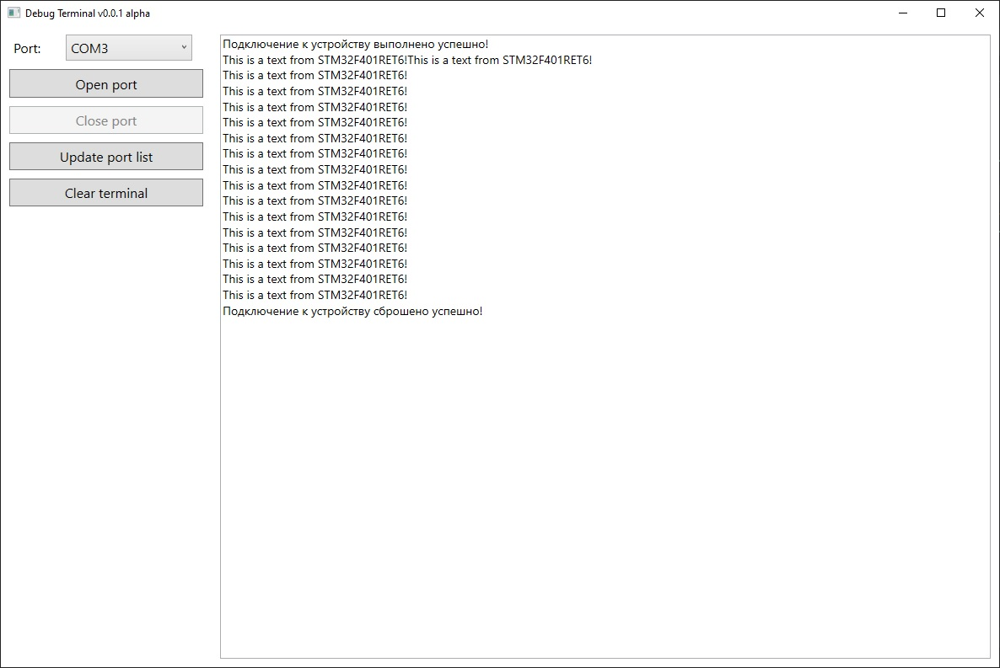

# О проекте
Debug terminal - простое приложение для вывода отладочной информации от микроконтроллера на ПК, используя аппаратные возможности в виде UART через конвертер UART to TTL или USB с реализайцией VCP (Virtual Com Port).

Проект разработан для личного пользования под ОС Windows.

# Стек
- Язык: C# 13
- Фреймворк: WPF
- Зависимости:
  - System.IO.Ports

# Демонстрация

